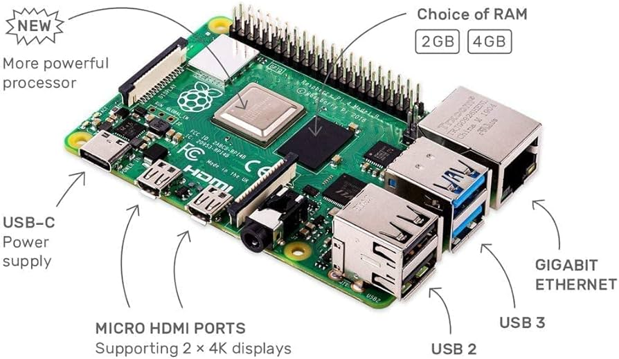
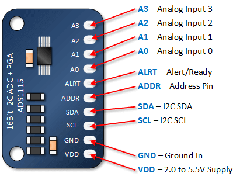
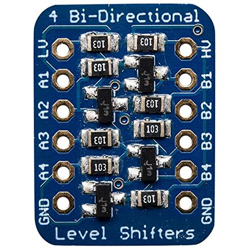
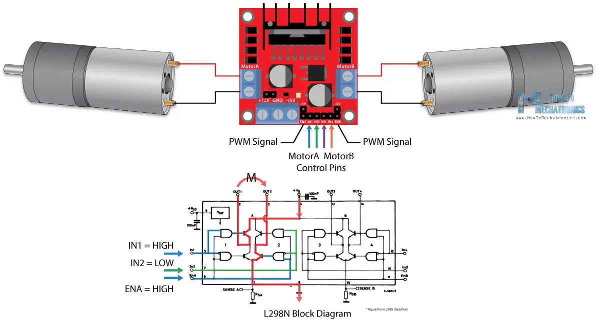
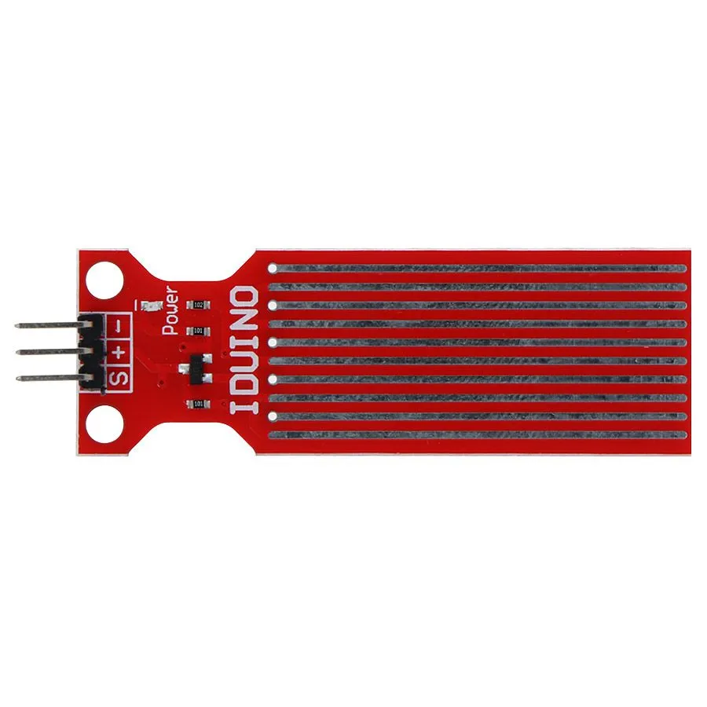
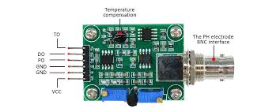
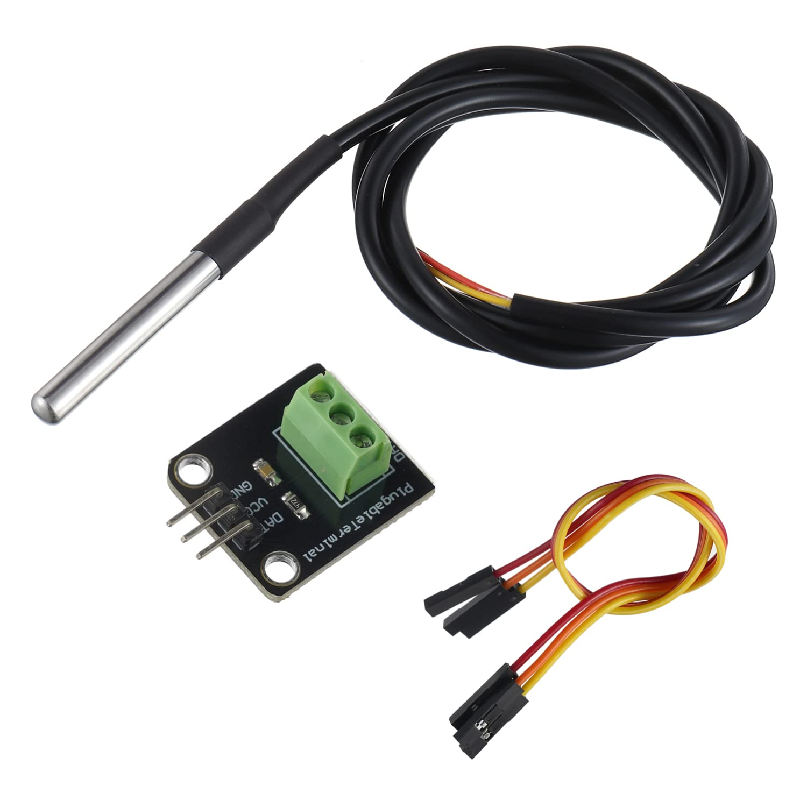
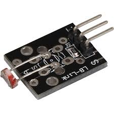
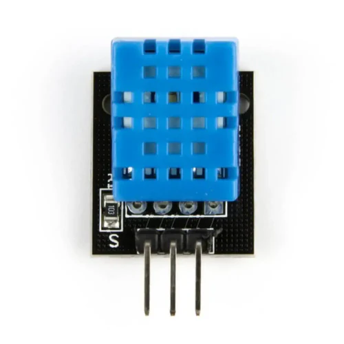
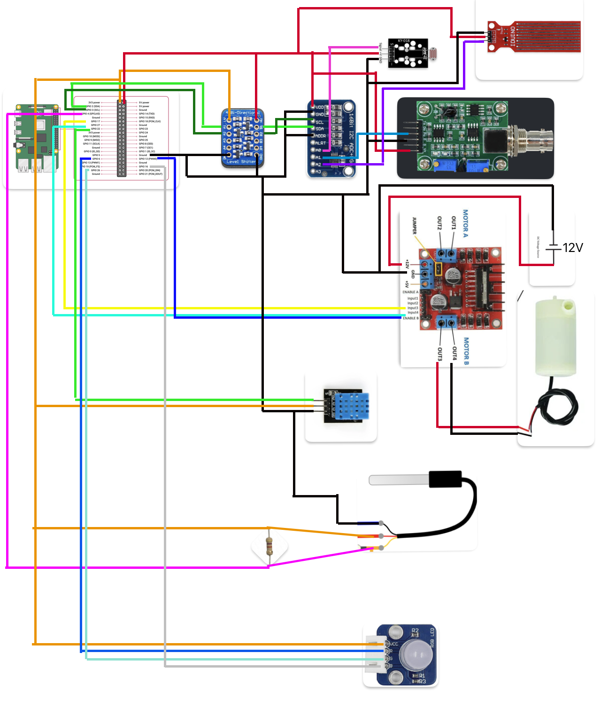

# ProjetADE-Raspberry

---
| :warning: Attention                              |
|:-----------------------------------------------:|
| Ce dépot GitHub concerne le Raspberry Pi.    |
| Pour consulter le site de collecte de données, rendez-vous sur le [Projet ADE](https://github.com/ArmoMan/ProjetADE). |
---

## Aquaponie
L’aquaponie est un écosystème interdépendant qui combine l’agriculture et la pisciculture. L’eau enrichie par les déchets des poissons, riche en azote, phosphore et potassium, est envoyée vers les plantes, qui utilisent les nutriments présents afin de croître. En chemin, des bactéries transforment les matières organiques en nitrate, ce qui joue un rôle crucial dans l’écosystème. Ces bactéries sont essentiellement un filtre biologique, puisque les déchets des poissons sont toxiques pour eux-mêmes. Donc, après être passée par les plantes, l’eau pourra être retournée vers les poissons. En lien avec l’informatique et les mathématiques, nous serons en mesure d’afficher les données importantes du système d’aquaponie sur un site Web directement relié aux capteurs du module. En consultant des graphiques et des données affichées, cela permettra à l’utilisateur de surveiller le processus de l’aquaponie, de s’assurer que tout va comme prévu et d’agir dès que quelque chose ne semble pas correct.
<div align="center">
  
</div>

## Table des matières
* [Aquaponie](#Aquaponie)
* [À propos de ce document (Projet ADE Client)](#projet-ade-client)
* [Cas d’utilisation ](#cas-dutilisation)
* [Matériel nécessaire](#matériel-nécessaire)
   * [Composants obligatoires](#composants-obligatoires)
   * [Capteurs](#capteurs)
      * [Eau](#eau)
      * [Hors de l'eau](#hors-de-leau)
   * [Autre](#autre)
* [Guide d’utilisation (Connexion des capteurs)](#guide-dutilisation-connexion-des-capteurs)
* [Informations additionnelles sur la structure des dossiers](#informations-additionnelles-sur-la-structure-des-dossiers)
* [Questions Et Réponses](#questions-et-réponses)
* [Installations](#installations)
   * [Installation de python et pip](#installation-de-python-et-pip)
   * [Autorisations](#autorisations)
   * [Installation des bibliothèques pour Raspberry Pi 4 Model B](#installation-des-bibliothèques-pour-raspberry-pi-4-model-b)

## Projet ADE Client

Le projet ADE est séparé en deux parties. La première est le "Projet ADE", qui permet aux utilisateurs de se connecter à un site pour récupérer une clé API et voir les données des capteurs ainsi que des graphiques analysant les données affichées dedans. Elle permet aussi de contrôler les capteurs (allumer/éteindre).

La deuxième partie est ce dépôt, qui est destiné à la partie "physique du projet". Il permet à n'importe quel utilisateur de connecter les capteurs souhaités (dans le choix des capteurs) à un Raspberry Pi 4 modèle B, d’accéder à une interface graphique et de se connecter au site du Projet ADE en ligne à l'aide d'une clé API.

## Cas d’utilisation 
1. Agriculteurs urbains : Un cultivateur peut installer le système pour surveiller son installation d’aquaponie électroniquement.
2. Écoles et universités : Les étudiants peuvent utiliser le projet pour apprendre les principes de l’aquaponie.
3. Petites fermes et startups agricoles : Elles peuvent adopter le système pour automatiser leurs productions et améliorer leur rendement.
4. Restaurants et chefs cuisiniers : Ils pourraient cultiver des aliments frais directement sur place, réduisant ainsi les coûts de production et de transport. Cela pourrait également améliorer la qualité et la traçabilité des aliments.
5. Communautés et ONG : Elles pourraient utiliser le système dans des projets humanitaires pour assurer la sécurité alimentaire dans des milieux où l’accès à l’eau est limité et améliorer l’autosuffisance des fermes communautaires.

## Guide d’utilisation (Connexion des capteurs)

1) Tout d’abord, il faut installer **VSCode** et **Python** sur votre Raspberry Pi. Ensuite, installez les librairies et faites les configurations nécessaires en suivant **cette étape :** [Installation et mise en place](#installation-de-python-et-pip). 

2) Une fois les installations effectuées, suivez le [**schéma dans le PDF**](#schéma-de-montage) pour connecter les [capteurs](#matériel-nécessaire). Assurez-vous de connecter les composants et les capteurs aux bons pins. Si vous voulez modifier les pins, assurez-vous qu’ils soient compatibles avec le capteur. Une fois ce choix fait, **modifiez les pins dans la classe `CreateurCapteur`, et pour le DS18B20, dans sa propre classe**.

3) **Note** : si certains capteurs nécessitent une **calibration**, utilisez les classes dans le dossier `calibrer` pour obtenir les données nécessaires à intégrer dans `CreateurCapteur`. Exécutez le fichier `calibrage.py`, où des exemples de calibrations sont déjà présents.

4) Une fois les étapes 1, 2, 3 terminées, allez dans le dossier `interface`, puis dans la classe `Accueil`. **Assurez-vous que la connexion socketIO se fait à la bonne adresse :** `ApplicationControleur(self.choix_cpateurs.get_capteurs(), "http://192.168.0.186:4545", cle_api)`  
Modifiez l’adresse si nécessaire.

5) Allez dans `main.py` et exécutez le fichier.

6) Choisissez les capteurs connectés.

7) Entrez la clé API.
> [!NOTE]  
> Assurez-vous d’avoir créé un compte sur le site du Projet ADE et d’avoir récupéré votre clé dans l’onglet "Voir clé API" du site.

8) Appuyez sur **Commencer**.  
> [!WARNING]  
> Assurez-vous que le site du Projet ADE est bien en ligne avant de démarrer.

## Matériel nécessaire

### Composants obligatoires

<!-- 1. **Raspberry Pi 4 modèle B**  

Les capteurs seront connectés à un Raspberry Pi, donc assurez-vous de disposer de cet appareil.

2. **ADS1115**  

Si vous avez des capteurs analogiques, il est nécessaire d’utiliser un ADC (convertisseur analogique-numérique) pour convertir le signal en numérique et permettre à l’appareil de lire les données.

3. **ADA757**  

Le Raspberry Pi accepte uniquement des signaux de 3,3V maximum. **Une tension plus élevée risquerait d’endommager le circuit**. Ce convertisseur ajuste la tension des signaux en provenance des capteurs analogiques de 5V à 3,3V avant d’atteindre le Raspberry Pi, et inversement. -->
| Matériel | Description |
|------|-------|
| **1. Raspberry Pi 4 modèle B**<br>  | Les capteurs seront connectés à un Raspberry Pi, donc assurez-vous de disposer de cet appareil. |
| **2. ADS1115**<br> |Si vous avez des capteurs analogiques, il est nécessaire d’utiliser un ADC (convertisseur analogique-numérique) pour convertir le signal en numérique et permettre à l’appareil de lire les données. |
| **3. ADA757**<br>| Le Raspberry Pi accepte uniquement des signaux de 3,3V maximum. **Une tension plus élevée risquerait d’endommager le circuit**. Ce convertisseur ajuste la tension des signaux en provenance des capteurs analogiques de 5V à 3,3V avant d’atteindre le Raspberry Pi, et inversement. |

### Capteurs

#### Eau
<!-- 1. Une **pompe de 12V** avec un contrôleur de moteur PWM **L298N** pour contrôler le débit d’eau.
2. **Capteur d’eau Iduino** pour mesurer la baisse d’eau dans le bassin ou l’aquarium.
3. **PH-4502C** pour mesurer le pH de l’eau.
4. **DS18B20** pour mesurer la température de l’eau. -->
| Matériel | Image |
|------|-------|
| 1. Une **pompe de 12V** avec un contrôleur de moteur PWM **L298N** pour contrôler le débit d’eau.|   |
| 2. **Capteur d’eau Iduino** pour mesurer la baisse d’eau dans le bassin ou l’aquarium. |  |
| 3. **PH-4502C** pour mesurer le pH de l’eau. |  |
| 4. **DS18B20** pour mesurer la température de l’eau. |   | 


#### Hors de l'eau
<!-- 1. Une lampe **RGB LED Module FREENOVE** pour simuler la lumière des plantes.
2. Un **KY-018** pour mesurer l’intensité de la lumière.
3. **DHT11** pour mesurer l’humidité et la température de l’air. -->
| Matériel | Image |
|------|-------|
| 1. Une lampe **RGB LED Module FREENOVE** pour simuler la lumière des plantes.|   |
| 2. Un **KY-018** pour mesurer l’intensité de la lumière. |  |
| 3. **DHT11** pour mesurer l’humidité et la température de l’air. |  |

### Autre
<!-- 1. **Ti-Cobbler Plus** est un accessoire essentiel pour ce projet. Il sert de rallonge pour accéder plus facilement aux broches GPIO et permet de voir clairement les numéros des broches auxquelles brancher les fils.

2. **Des fils connecteurs**

3. **Des séparateurs de fils** : Comme plusieurs capteurs peuvent être connectés aux mêmes broches, il est nécessaire d’utiliser des séparateurs pour pouvoir relier un même fil à plusieurs composants, et inversement. -->
| Matériel | Image |
|------|-------|
| 1. **Ti-Cobbler Plus** est un accessoire essentiel pour ce projet. Il sert de rallonge pour accéder plus facilement aux broches GPIO et permet de voir clairement les numéros des broches auxquelles brancher les fils.|   |
| 2. **Des fils connecteurs** |  |
| 3. **Des séparateurs de fils** : Comme plusieurs capteurs peuvent être connectés aux mêmes broches, il est nécessaire d’utiliser des séparateurs pour pouvoir relier un même fil à plusieurs composants, et inversement. |  |

## Schéma de montage
#### Voici le schéma de montage:
Pour plus de détails, consultez ce [PDF](./pdf/schema-github.pdf).


## Diagramme de classes
Pour plus de détails, consultez ce [PDF](./pdf/pre-final.pdf).


### Informations additionnelles sur la structure des dossiers

#### `calibrer`
Contient les classes pour calibrer les capteurs. Elles retournent les chiffres nécessaires aux classes principales pour afficher les bons résultats. À utiliser uniquement dans `calibrage.py`.

#### `capteurs`
Contient les classes des capteurs.  
Voici les sous-dossiers :
- `analogique` : Capteurs analogiques.  
- `numérique` : Capteurs numériques.  
- `actionnable` : Capteurs analogiques contrôlables.

#### `communication`
Contient les classes qui permettent d’établir une connexion entre le Raspberry Pi et le site du Projet ADE.

#### `controlleurs`
Voici les sous-dossiers :
- `application` : Contient la classe principale qui contrôle toute la logique de l’application.
- `composants` : Contient les classes et dossiers des composants autres que les capteurs, comme par exemple les convertisseurs analogiques.

#### `interface`
Contient les classes de l’interface graphique.

#### `main.py`
Point d’entrée de l’application. C’est le fichier à exécuter pour démarrer le système.

## Questions Et Réponses

### Peut-on ajouter d'autres capteurs ?
| Oui     |
|---------|
| Pour ce faire, codez votre capteur et ajoutez la classe dans les dossiers correspondants du dossier `capteurs`. Utilisez les classes parentes nécessaires, disponibles dans le dossier : `CapteursParent`, `ParentControleurGPIO`, `CapteurAnalogiqueParent`, etc. |
| Si vous avez besoin d’utiliser des composants autres que les capteurs, allez dans `controlleurs/composants` et utilisez les classes existantes ou créez la vôtre dans ce dossier. |


## Installations
---
| :warning: Attention                              |
|:-----------------------------------------------:|
| La section suivante concerne les installations à effectuer sur le Raspberry Pi.   |
---

## Installation de python et pip

**Vérifiez** que Python et pip sont bien installés.

```
python3 --version
```
et
```
pip3 --version
```

## Autorisations

### Activer la communication I2C sur l'appareil

Dans le **Terminal** entrez la [commande](https://www.raspberrypi-spy.co.uk/2014/11/enabling-the-i2c-interface-on-the-raspberry-pi/) suivante

```
sudo raspi-config
```

Visitez **"Interfacing Options"**, choisissez **I2C** et **activez** l'option

## Installation des bibliothèques pour Raspberry Pi 4 Model B

### Lecture de signale analogique avec ADS1115 (Convertisseur Analogique-Numérique)

**Installez** la bibliothèque nécessaire avec la commande suivante :
```
sudo pip3 install adafruit-circuitpython-ads1x15
```

Si votre Raspberry Pi **ne permet pas** une installation globale de cette bibliothèque, utilisez l'option `--break-system-packages` pour **forcer l'installation**:
```
sudo pip3 install --break-system-packages adafruit-circuitpython-ads1x15
```

### Pour l'interface graphique il faut PyQt6

**Installez [PySide6](https://pypi.org/project/PyQt6/)** avec la [commande](https://forum.qt.io/topic/135892/insudo%20apt%20install%20python-pyqt5) suivante :
```
pip3 install PySide6 
```
ou
```
pip3 install PySide6 --break-system-packages
```

### Pour le capteur DHT

**Installez [Adafruit_CircuitPython_DHT](https://github.com/adafruit/Adafruit_CircuitPython_DHT)** avec la commande suivante :
```
pip3 install adafruit-circuitpython-dht
```
ou
```
pip3 install adafruit-circuitpython-dht --break-system-packages
```

### Installation du package pour la communcation

**Installez [SocketIO Client](https://python-socketio.readthedocs.io/en/stable/client.html#installation)**

```
pip install "python-socketio[client]"
```
ou
```
pip install "python-socketio[client]" --break-system-packages
```

### Installation du package w1thermsensor

Pour le capteur DS18B20, il faut faire des installations et ajustements

#### **Vous avez deux options pour installer la bibliothèque :**

```
pip install w1thermsensor --break-system-packages
```

ou  

```
sudo apt-get install python3-w1thermsensor
```

#### **Ensuite, il faut configurer le raspberry pi:**

1. **Ouvrir le fichier de configuration**  
   Dans un terminal, exécutez :
   ```
   sudo nano /boot/firmware/config.txt
   ```

2. **Activer le capteur 1-Wire**  
   Recherchez la ligne suivante :
   ```
   #dtoverlay=w1-gpio
   ```

   Supprimez le `#` au début pour activer l'option :
   ```
   dtoverlay=w1-gpio
   ```

3. **Redémarrer le système**  
   Une fois la modification enregistrée, redémarrez votre Raspberry Pi :
   ```
   sudo reboot
   ```

> [!CAUTION]
> Le capteur doit être branché sur le pin GPIO 4. C'est obligatoire, sinon visitez [w1thermsensor](https://github.com/timofurrer/w1thermsensor) pour la configuration.